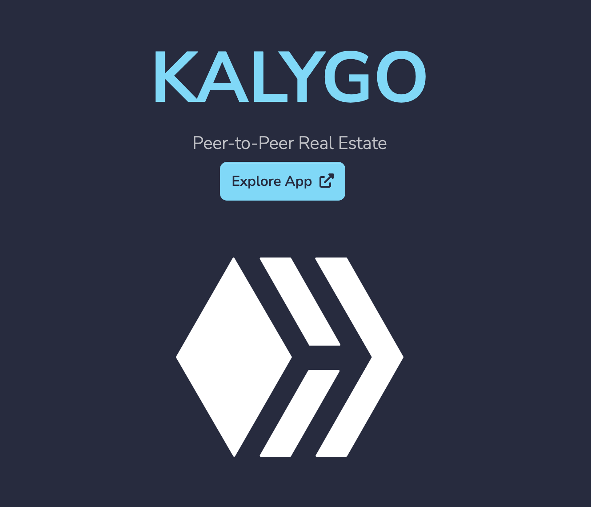

LIVE SITE: https://kalygo.io

YOUTUBE DEMO: https://www.youtube.com/watch?v=VpdbEolYOVo

# Kalygo.io CONTRACTS
This is the front end for the kalygo.io website. The concept of this site is it is the front end for a website that allows visitors to implement common real estate transactions on a blockchain.

The website has three common Real Estate contracts (or financial vehicles):

1) Purchase with Financing (v1 implemented)

found in the `./contracts/contract.py` file

2) REIT (v1 implemented)

Implemented as a non-fungible ASA

3) Cash purchase (in development)

Coming Soon...

## Greenhouse Hackathon Related Information
I began working on this concept after the `Miami for Everyone` hackathon that was sponsored by ALGORAND in Miami on the dates of JUNE 17-19, 2022. I did most of the work for this app in the first 2 weeks of July and as I was interacting with the ALGORAND discord during development I found out about the Greenhouse hackathon.

After meeting some of the ALGORAND foundation representatives in Discord (such as MonopolyMan#1876, barnji#6679 and nullun#0110), I asked if I could submit the app to the Greenhouse competition and MonopolyMan#1876 suggested I submit this project on the BYOP bounty track.

## Additional technical information
This was developed locally using the Algorand Sandbox and PyTeal.

## Miscellaneous reference material
https://github.com/algorand/sandbox

https://pyteal.readthedocs.io/en/stable/
